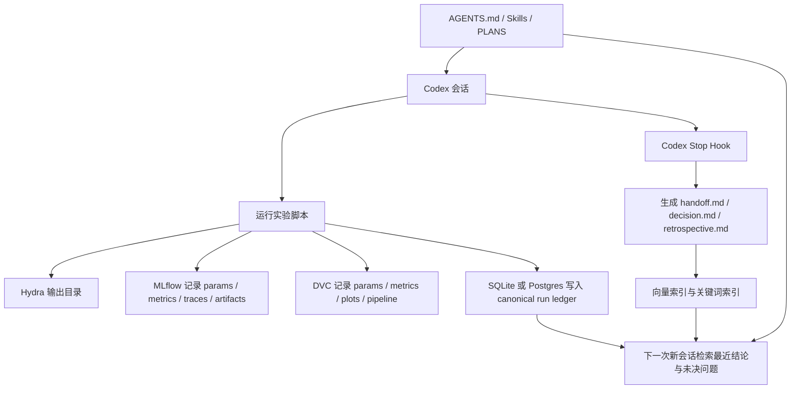

# 长迭代算法开发中与 AI 编码代理协作的交接与上下文持久化研究报告

## 执行摘要

对于你描述的这类“长周期、强实验驱动、类似 Monte Carlo 式反复试验”的算法研发，实践上最有效的思路并不是把 handoff 当成“写一篇更长的会话总结”，而是把状态拆成三层：其一是**规范化实验账本**，也就是结构化、可查询、可追溯的参数、指标、版本、工件记录；其二是**叙事记忆**，也就是决策、结论、失败原因、下一步假设等可以被人和代理共同理解的摘要；其三是**流程记忆**，也就是稳定的仓库规则、实验协议、计划模板与自动化脚本。这个分层与近期 agent memory 文献对**语义记忆**（事实）、**情景记忆**（经历）、**程序记忆**（规则）的划分高度一致，也和 LangGraph、Codex skills、MLflow、DVC、W&B 等工具的实际能力边界相吻合。citeturn16view1turn15search0turn25view0turn19view0turn24view0turn36search0

从研究角度看，真正与“人工把一个长会话交给下一次新会话”完全同构的文献并不多；最近五年的主线其实是四个方向：**长上下文退化**、**外部记忆/层级记忆**、**状态检查点**、**多代理 handoff 与 context engineering**。LoCoMo 基准直接说明：即使长上下文模型和 RAG（retrieval-augmented generation，指用外部检索结果增强生成）能提升多会话问答，和人类相比仍明显落后，尤其在**时间顺序推理**上更弱；这正对应你“实验结论、参数、阶段变化在交接后丢失”的体验。citeturn1search1turn1search5turn9view1

从工程角度看，Codex 已经提供了几项非常关键但常被低估的能力：本地 transcript 持久化与 `resume`、会话压缩 `/compact`、分层 `AGENTS.md`、可在停止阶段自动生成总结的 hooks、以及用**渐进披露**（progressive disclosure，指先只暴露技能名和描述，需要时再载入完整内容）减少上下文膨胀的 skills。它们足以把“每次都手工整理 handoff 文档”升级为“会话结束自动沉淀、下一会话自动读取”。citeturn8view0turn27view1turn8view2turn27view0turn36search0turn36search2

如果没有特殊预算、算力、基础设施约束，我给出的首选方案是：**本地优先**。具体是：`Git + Hydra + MLflow + DVC + SQLite/Postgres + 可选 pgvector/Chroma + Codex CLI hooks/skills/AGENTS/PLANS`。其中，SQLite 适合先落地；当你需要多人协作、可并发写入和语义检索时，再升级到 Postgres + pgvector。对于你这样的实验型算法开发，这一栈的核心原则是：**参数、指标、工件永远以结构化方式落盘；总结只是索引，不是事实本体**。citeturn20search0turn19view1turn25view0turn25view1turn25view2turn22view3turn22view2

## 问题本质与研究边界

你的痛点可以精确拆成三个失效源。第一类是**上下文窗失效**：会话越长，消息历史越臃肿，模型可见上下文虽然可能仍“放得下”，但检索注意力会被早期无关细节稀释，成本和延迟也会升高。LangChain 的 memory 文档明确指出，长历史即便未触发硬性长度错误，也常让模型被陈旧内容“分心”，表现变差。LoCoMo 又进一步表明，多会话长期记忆最难的不是事实回忆本身，而是**跨会话时间关系和事件演化**。citeturn9view1turn1search1turn1search5

第二类是**总结代替状态**：当你把一次会话压缩成 handoff prompt 时，压缩过程天然会丢失高熵细节，例如随机种子、试验分支、特征开关组合、数据快照、失效样本 ID、验证脚本版本。近期文献普遍把外部记忆视为 agent 能力的关键，而不是把所有状态继续挤进提示词。MemGPT 用操作系统式层级记忆来弥补有限上下文；Generative Agents 用“记忆—反思—规划”解释为什么仅保存原始观察并不足够；Reflexion 则说明把试错反馈写成可复用的情景记忆，比单纯重复上下文更有效。citeturn1search2turn1search3turn2search0

第三类是**文档散落且没有唯一真源**。如果 handoff 文档、实验日志、参数文件、生成图表、会话摘要分别散落在聊天记录、Markdown、终端、Excel、`tmp/` 目录和脑内记忆里，那么交接本质上是在拼碎片，而不是在读取系统状态。近两年的工程框架都在朝同一个方向收敛：把**线程状态**、**长期记忆**、**可审计工件**、**追踪信息**拆开管理。LangGraph 把 thread-scoped checkpoints 与 cross-thread long-term store 分离；MLflow 把元数据 backend store 与 artifacts store 分离；W&B 把 runs 与 artifacts/lineage 分离；DVC 把 params、metrics、plots、pipeline 和数据版本一体化。citeturn9view0turn15search0turn25view1turn25view2turn24view0turn24view1turn19view0

需要明确的一点是：**“AI coding agent handoff”作为专门研究主题仍偏稀疏**。更成熟的直接证据主要来自 memory、checkpoint、RAG、multi-agent handoff 这几个相邻子领域。因此，下面的建议是“以一手文献和官方文档为基础的工程综合推断”，而不是声称学界已经给出单一标准答案。citeturn1search4turn31search0turn33view1

## 学术文献结论

下表总结了近五年里最值得直接拿来指导 handoff 设计的文献。它们共同指向一个结论：**不要把交接理解为“继续聊天”，而要把它理解为“恢复可执行状态 + 恢复可解释判断 + 恢复约束条件”**。citeturn1search3turn2search0turn1search2turn1search5turn16view1turn2search3turn34academia18

| 文献 | 核心结论 | 对长实验算法开发的直接启示 |
|---|---|---|
| *Generative Agents* 2023 citeturn1search3 | 代理的长期行为依赖“记忆、反思、规划”三件套，而不只是保存原始观察。 | handoff 文档必须包含**结论/反思**，不能只有日志摘录。 |
| *Reflexion* 2023 citeturn2search0 | 试错反馈写入情景记忆缓冲区，可提升后续决策。 | 每轮实验后的“失败原因”和“下轮修正”应成为显式可检索对象。 |
| *MemGPT* 2023/2024 citeturn1search2turn1search6 | 用层级记忆管理有限上下文，模拟更大“工作记忆”。 | 参数细节、长历史、文档知识不应都塞进 prompt；应分层存储。 |
| *LoCoMo* 2024 citeturn1search1turn1search5 | 多会话长期记忆任务中，长上下文与 RAG 虽有改善，但时间推理仍显著落后人类。 | 交接必须显式记录**时间线**、版本演化和结论生效范围。 |
| 记忆机制综述 2024 citeturn1search4 | memory 设计需要考虑记忆类型、写入时机、检索方式与评估。 | 你的系统至少要区分“规范事实”“实验经历”“流程规则”。 |
| LangMem 概念指南 2025/2026 citeturn16view1 | 语义记忆、情景记忆、程序记忆对应不同存储与检索逻辑。 | 建议把“参数/结论/协议”分三套表或三类文档处理。 |
| *A-MEM* 2025 citeturn2search3 | 记忆不应只追加，还应自动建立关联并演化更新。 | 结论若被新实验推翻，应有 `supersedes` 关系，而不是写新文档覆盖旧文档。 |
| *Plan-and-Solve* 2023 citeturn34academia18 | 先规划再执行可减少漏步骤错误。 | 复杂任务应先生成 ExecPlan/PLANS，再进入代码与实验执行。 |

这组文献给出的最重要工程抽象，是把记忆区分为三类。**语义记忆**是较稳定的事实，例如“实验 A 在数据集 D、特征集 F、随机种子 S 下得到指标 M”；**情景记忆**是经历与轨迹，例如“上周尝试把 CFAR 阈值加权到雨天样本时，误检变多”；**程序记忆**是规则与方法，例如“所有新实验必须先固定 `params.yaml`，再执行复现实验、再更新 handoff”。如果不分这三类，系统要么难搜，要么难用，要么会不断自相矛盾。citeturn16view1turn1search4

## 工程框架与工具对比

先说与你最贴近的 Codex。Codex CLI 已支持本地 transcript 持久化，`codex resume` 能恢复原 transcript、计划历史与批准历史；`/compact` 可以把可见会话压缩为摘要以释放 tokens；`AGENTS.md` 支持全局与项目分层加载，但默认总大小上限为 32 KiB，因此它更适合放**稳定规则**而不是频繁变化的实验状态；hooks 可以在 `Stop`、`PostToolUse` 等阶段自动触发脚本，官方示例甚至直接把“自动总结会话、创建持久记忆”作为典型用途；skills 则用渐进披露减少初始上下文负担，适合把可复用实验流程做成 playbook。OpenAI Cookbook 进一步给出了 `PLANS.md` 和自动生成 `codex_handoff.md` 的闭环实践。citeturn8view0turn27view1turn8view2turn27view0turn36search0turn36search2turn34search0turn30view1

如果你自己构建代理系统，而不是完全依赖 CLI 对话，那么 OpenAI 的 Responses API 支持用 `previous_response_id` 链接响应，也支持用 Conversations API 把会话状态保存为带 durable ID 的长生命周期对象；这非常适合做你自己的“会话外壳”。但它仍不等于实验账本，因为会话状态更偏对话连续性，而不是参数、指标、工件的审计式查询。citeturn6search0turn6search2turn7search0turn7search6

下表是对主要工程框架的比较。表中“易集成/成本/延迟/持久性/搜索性/隐私”是依据官方架构能力和部署方式做的工程判断，不是厂商官方打分。citeturn9view0turn15search0turn13view0turn13view1turn10view0turn12view0turn12view1turn5view0

| 工具或框架 | 官方持久化/记忆机制 | 易集成 | 成本 | 延迟 | 持久性 | 搜索性 | 隐私 | 适合度判断 |
|---|---|---:|---:|---:|---:|---:|---:|---|
| **Codex CLI** | 本地 transcript、`resume`、`/compact`、`AGENTS.md`、hooks、skills citeturn8view0turn27view1turn27view0turn36search0 | 高 | 低到中 | 低 | 中 | 中 | 高（本地优先） | 你当前工作流的最佳起点 |
| **LangGraph / LangChain** | `thread_id` checkpoints + cross-thread store；JSON docs 按 namespace/key 存储；可接 Postgres citeturn9view0turn9view2turn15search0 | 中 | 中 | 低到中 | 高 | 高 | 高（自托管时） | 最适合做“状态机 + 长期记忆”骨架 |
| **AutoGen** | `save_state()`/`load_state()`；Memory protocol；ChromaDB/Redis/Mem0 等扩展 citeturn13view0turn14view0turn14view1turn13view1 | 中 | 中 | 中 | 高 | 高 | 中到高 | 适合多代理对话和可序列化状态 |
| **CrewAI** | 统一 `Memory`；自动抽取事实、合并相似记忆；默认 LanceDB，本地目录持久化 citeturn10view0turn11view2 | 高 | 低到中 | 中 | 中到高 | 中到高 | 中到高 | 上手快，但记忆写入更“代理化” |
| **LlamaIndex** | `Memory` 短期队列 + 长期 memory blocks；WorkflowCheckpointer 可恢复运行 citeturn12view0turn12view1 | 中 | 中 | 中 | 中到高 | 高 | 中到高 | 适合文档/索引较重的代理 |
| **AutoGPT 平台/Forge** | 当前官方重心是 continuous agents、Forge、benchmark、Agent Protocol，公开文档中并未像上面几家那样突出统一记忆抽象 citeturn5view0 | 中 | 中 | 中 | 取决于自定义 | 取决于自定义 | 取决于部署 | 更适合参考 workflow/benchmark，而非直接做实验记忆内核 |

对于“handoff”这个概念，LangChain 对它的定义很有参考价值：handoff 不是拷贝整段上下文，而是**由状态变量驱动的行为切换**。无论是切换到另一个 agent，还是切换当前 agent 的系统提示、工具和阶段，本质都应由一个持久化状态来驱动。这与你的新会话 handoff 完全等价：下一次会话不应该靠人工再解释“我们现在在哪一步”，而应直接读取 `current_step / active_agent / latest_stable_run / pending_hypothesis` 之类的状态。citeturn33view1turn33view2

## 推荐工作流与数据模型

对这类算法研发，我建议采用“**账本层 + 检索层 + 流程层**”三层结构。

**账本层**是唯一事实源。这里保存每一次实验运行的参数、代码版本、数据版本、随机种子、指标、图表、二进制工件、终端命令、耗时与状态。Hydra 适合负责配置组合、multirun 和自动输出目录；DVC 负责把 `params/metrics/plots` 与 pipeline 关系显式化；MLflow 负责 runs、参数、指标、artifact 与 traces；W&B 在你需要 artifact lineage（血缘图，指工件输入输出关系图）和协作看板时非常强。citeturn20search0turn20search1turn20search4turn19view1turn19view2turn25view0turn25view3turn24view0turn24view1

**检索层**不是记日志，而是为下一会话准备“可召回语义”。它主要保存三类文档：`decision`（决策）、`retrospective`（复盘）、`handoff`（交接）。这些文档要带上强引用：`run_id`、`git_commit`、`dataset_version`、`artifact_path`、`supersedes`。只有这样，向量检索（vector search，指把文本转成 embedding 向量后做相似搜索）找到的内容才能回链到账本层，而不是成为新的漂浮摘要。pgvector 能把向量和关系数据同放在 Postgres；Chroma 和 Qdrant 更偏专用检索；OpenAI Vector Store 更省集成，但隐私和控制力较低。citeturn22view3turn22view2turn22view0turn22view1turn23search1turn23search2turn23search15

**流程层**保存稳定协议，而不是保存每次实验结果。这里应该放 `AGENTS.md`、技能文档、PLANS 模板、评估门槛、命名规范、目录规范、自动化 hooks。Codex 的 `AGENTS.md` 是分层合并、面向长期复用的；skills 适合把“如何写 handoff”“如何跑复现实验”“如何做结果审查”做成按需加载的 skill；而 `PLANS.md`/ExecPlan 非常适合承载复杂重构或多天实验的“活文档”。citeturn8view2turn36search0turn36search2turn34search0

推荐工作流如下：



这个流程的核心设计点有两个。第一，**总结是从结构化数据自动生成出来的，而不是反过来**；第二，下一会话读取时优先读“最近稳定结论 + 未决假设 + 证据链接”，只有在需要时才回看完整 transcript。这样可以同时降低上下文成本与信息丢失风险。这个思路与 Codex 的 `/compact`、skills 渐进披露、LangGraph 的 checkpoints/store 分层、以及 OpenAI 最近的 trace→eval→handoff flywheel 完全一致。citeturn27view1turn36search0turn9view0turn15search0turn30view1

还需要一张存储方案对比表。下表同样是基于官方文档与典型部署形态做的工程判断。citeturn22view3turn22view0turn22view1turn25view1turn23search1turn25view2

| 存储方案 | 易集成 | 成本 | 延迟 | 持久性 | 搜索性 | 隐私 | 建议用途 |
|---|---:|---:|---:|---:|---:|---:|---|
| **文件 + Git** | 很高 | 很低 | 很低 | 中 | 低 | 很高 | 存稳定文档、模板、计划、总结 |
| **SQLite / DuckDB** | 很高 | 很低 | 很低 | 中 | 中 | 很高 | 单人起步的 canonical ledger |
| **Postgres + pgvector** | 中 | 中 | 低到中 | 很高 | 很高 | 很高 | 首选的长期主库方案 |
| **Chroma Persistent** | 高 | 低 | 低 | 中 | 高 | 高 | 单机语义检索，快速验证 |
| **Qdrant Local / Cloud** | 中 | 低到中 | 低 | 高 | 很高 | 中到高 | 语义检索为主、规模更大 |
| **OpenAI Vector Store** | 高 | 中到高 | 中 | 高 | 高 | 中 | 最省开发，但可控性与隐私较弱 |

## 具体实现示例

先给一个适合单人算法研发的目录布局。它的目标是把“会话、实验、交接、计划、工件”全部落在仓库可管理范围内。

```text
repo/
├─ AGENTS.md
├─ .codex/
│  ├─ config.toml
│  └─ hooks.json
├─ plans/
│  └─ 2026-05-14_threshold-search_execplan.md
├─ handoffs/
│  └─ latest_handoff.md
├─ decisions/
│  └─ decision_2026-05-14_false_alarm_tradeoff.md
├─ params/
│  ├─ base.yaml
│  └─ sweep.yaml
├─ runs/
│  └─ 2026-05-14_153012_seed42/
│     ├─ config_resolved.yaml
│     ├─ metrics.json
│     ├─ plots/
│     ├─ stdout.log
│     └─ artifacts/
├─ mlruns/
├─ dvc.yaml
├─ tools/
│  ├─ run_experiment.py
│  ├─ log_run.py
│  └─ generate_handoff.py
└─ state/
   └─ agent_state.db
```

对于数据库，我建议至少有五张核心表：`runs`、`metrics`、`artifacts`、`decisions`、`handoffs`。如果后面要加语义检索，再补 `memory_docs`。下面是一个可直接落地到 SQLite 或 Postgres 的简化 schema：

```sql
CREATE TABLE runs (
    run_id TEXT PRIMARY KEY,
    created_at TEXT NOT NULL,
    git_commit TEXT NOT NULL,
    git_branch TEXT,
    dataset_version TEXT,
    code_version TEXT,
    seed INTEGER,
    status TEXT NOT NULL,           -- running / success / failed / superseded
    config_json TEXT NOT NULL,      -- 完整参数快照
    summary TEXT
);

CREATE TABLE metrics (
    run_id TEXT NOT NULL,
    metric_name TEXT NOT NULL,
    metric_step INTEGER DEFAULT 0,
    metric_value REAL NOT NULL,
    PRIMARY KEY (run_id, metric_name, metric_step),
    FOREIGN KEY (run_id) REFERENCES runs(run_id)
);

CREATE TABLE artifacts (
    artifact_id TEXT PRIMARY KEY,
    run_id TEXT NOT NULL,
    kind TEXT NOT NULL,             -- plot / model / log / report / dataset-slice
    path TEXT NOT NULL,
    sha256 TEXT,
    metadata_json TEXT,
    FOREIGN KEY (run_id) REFERENCES runs(run_id)
);

CREATE TABLE decisions (
    decision_id TEXT PRIMARY KEY,
    created_at TEXT NOT NULL,
    title TEXT NOT NULL,
    conclusion_md TEXT NOT NULL,
    status TEXT NOT NULL,           -- open / active / superseded
    evidence_run_ids_json TEXT NOT NULL,
    supersedes_decision_id TEXT
);

CREATE TABLE handoffs (
    handoff_id TEXT PRIMARY KEY,
    created_at TEXT NOT NULL,
    based_on_run_id TEXT,
    target_session_hint TEXT,
    handoff_md TEXT NOT NULL,
    prompt_sha256 TEXT
);

CREATE TABLE memory_docs (
    doc_id TEXT PRIMARY KEY,
    doc_type TEXT NOT NULL,         -- decision / retrospective / handoff / note
    namespace TEXT NOT NULL,        -- project / algorithm / dataset / branch
    ref_id TEXT,                    -- 对应 run_id 或 decision_id
    title TEXT NOT NULL,
    body_md TEXT NOT NULL,
    embedding_model TEXT,
    created_at TEXT NOT NULL,
    updated_at TEXT NOT NULL,
    is_canonical INTEGER NOT NULL DEFAULT 0
);
```

这个 schema 的关键点是：`runs` 和 `metrics` 负责客观事实，`decisions` 与 `handoffs` 负责人机共享语义，`supersedes_decision_id` 用来维护“旧结论被新证据推翻”的链式更新。这正对应 A-MEM、LangMem、W&B lineage、MLflow metadata/artifact 分离所强调的“记忆不是简单 append-only，而要可演化、可溯源”。citeturn2search3turn16view1turn24view1turn25view1turn25view2

然后是 Codex 自动化。官方 hooks 支持在 `Stop` 等阶段运行命令，而且官方明确把“自动总结会话、创建持久记忆”列为用途之一，因此完全可以让会话结束时自动生成 handoff。citeturn27view0

```json
{
  "hooks": {
    "Stop": [
      {
        "hooks": [
          {
            "type": "command",
            "command": "/usr/bin/python3 \"$(git rev-parse --show-toplevel)/tools/generate_handoff.py\"",
            "statusMessage": "生成实验交接摘要",
            "timeout": 30
          }
        ]
      }
    ]
  }
}
```

配套的 `generate_handoff.py` 可以非常简单：读取最新 run、未关闭 decisions、当前 Git 状态，然后输出一个统一模板的 `handoffs/latest_handoff.md`。示意代码如下：

```python
from __future__ import annotations
import json
import sqlite3
import subprocess
from pathlib import Path
from datetime import datetime, timezone

ROOT = Path(__file__).resolve().parents[1]
DB = ROOT / "state" / "agent_state.db"
OUT = ROOT / "handoffs" / "latest_handoff.md"

def git(cmd: list[str]) -> str:
    return subprocess.check_output(cmd, cwd=ROOT).decode("utf-8").strip()

def main() -> None:
    conn = sqlite3.connect(DB)
    conn.row_factory = sqlite3.Row

    run = conn.execute("""
        SELECT * FROM runs
        ORDER BY created_at DESC
        LIMIT 1
    """).fetchone()

    decisions = conn.execute("""
        SELECT decision_id, title, conclusion_md
        FROM decisions
        WHERE status IN ('open', 'active')
        ORDER BY created_at DESC
        LIMIT 10
    """).fetchall()

    metrics = conn.execute("""
        SELECT metric_name, metric_value
        FROM metrics
        WHERE run_id = ?
        ORDER BY metric_name
    """, (run["run_id"],)).fetchall() if run else []

    commit = git(["git", "rev-parse", "HEAD"])
    branch = git(["git", "rev-parse", "--abbrev-ref", "HEAD"])
    status = git(["git", "status", "--short"]) or "(clean)"

    lines = [
        f"# Handoff {datetime.now(timezone.utc).isoformat()}",
        "",
        "## 当前快照",
        f"- branch: `{branch}`",
        f"- commit: `{commit}`",
        f"- latest_run: `{run['run_id']}`" if run else "- latest_run: none",
        f"- run_status: `{run['status']}`" if run else "- run_status: none",
        "",
        "## 最新实验关键指标",
    ]
    for m in metrics:
        lines.append(f"- {m['metric_name']}: {m['metric_value']}")
    lines += ["", "## 当前有效结论 / 未决问题"]
    for d in decisions:
        lines.append(f"- **{d['title']}** ({d['decision_id']}): {d['conclusion_md'][:200]}...")
    lines += [
        "",
        "## 工作区状态",
        "```",
        status,
        "```",
        "",
        "## 下一个会话建议提示词",
        "请先读取本文件、相关 decision 文档和 latest run 的 config/metrics/artifacts，",
        "不要重复探索已证伪路线；先确认哪些结论仍有效，再提出下一轮最小实验集合。",
    ]

    OUT.parent.mkdir(parents=True, exist_ok=True)
    OUT.write_text("\n".join(lines), encoding="utf-8")

if __name__ == "__main__":
    main()
```

`AGENTS.md` 里则不要重复罗列易变事实，而应只写**协议**。例如：

```md
## Experiment protocol
- 所有实验必须先固定参数文件，再运行。
- 每次运行都必须写入 run ledger、metrics 与 artifacts。
- 复杂任务先写 ExecPlan 到 plans/ 目录，再实施。
- 任何结论都必须写成 decision 文档，并指向证据 run_id。
- 会话结束依赖 Stop hook 自动生成 handoff，不要手工散写摘要。
```

如果你打算把自己的会话外壳也做成可持久化服务，那么 OpenAI 的 Conversations API 可以持久化一个 conversation object；Responses API 也可以用 `previous_response_id` 形成连续线程。它们很适合保存“对话连续性”，但我仍建议把实验账本与 handoff 文档放在你自己的数据库里。citeturn7search0turn6search0turn6search2

```python
from openai import OpenAI
client = OpenAI()

conversation = client.conversations.create()

r1 = client.responses.create(
    model="gpt-5.4",
    conversation=conversation.id,
    input="读取 handoffs/latest_handoff.md，并总结当前算法状态。"
)

r2 = client.responses.create(
    model="gpt-5.4",
    conversation=conversation.id,
    input="基于最新 run 的指标，给出下一轮最小实验集。"
)
```

最后，给你一个建议使用的 handoff 模板。这个模板的设计原则，是把“给代理看的 prompt”变成“从数据库和工件自动拼装出来的可执行简报”。

```md
# Session Handoff

## 项目身份
- algorithm_scope:
- branch:
- commit:
- dataset_version:
- latest_stable_run_id:

## 当前目标
- 这轮要优化什么指标
- 不允许破坏什么指标
- 当前约束（时延、误检、算力、接口兼容性等）

## 已验证结论
- [结论] ...
  - evidence_run_ids:
  - artifact_paths:
  - 生效前提:

## 已证伪路线
- [失败路线] ...
  - 原因:
  - 证据:
  - 不要重复尝试的原因:

## 未决假设
- [假设] ...
  - 最小验证实验:
  - 成功判据:
  - 失败判据:

## 下一步最小实验集
- exp_1:
- exp_2:
- exp_3:

## 读取顺序
1. AGENTS.md
2. 本 handoff
3. latest run config + metrics + plots
4. 相关 decision 文档
5. 如有必要，再回看 transcript
```

## 权衡与失效模式

最常见的失效模式，不是“模型忘了”，而是**系统把不可压缩的事实交给了可压缩的摘要**。参数、版本、种子、样本切片、脚本路径、失败日志这类信息一旦只存在于叙事总结，后续就很难可靠复现；LoCoMo 说明多会话时间推理本就困难，LangChain 也反复强调长上下文会分心。缓解策略只有一个：**把事实放在 ledger；把总结变成指针**。citeturn1search5turn9view1

第二类失效是**状态污染**。例如把过多易变实验背景塞进 `AGENTS.md`，或者把整个历史聊天变成巨大的 skills 文本。Codex 官方文档已经在两个层面给出提醒：`AGENTS.md` 有默认 32 KiB 合并上限，skills 之所以采用渐进披露，就是为了避免一上来把全部上下文灌进模型。你的稳定流程性规则应放在 `AGENTS.md`/skills，中间态实验结果则应放到状态库与 handoff 文档。citeturn8view2turn36search0

第三类失效是**记忆自相矛盾**。CrewAI 文档已经把“consolidation”（记忆合并）和后台写入失败专门拿出来说明；LangMem 与 A-MEM 也都强调新记忆不应只是追加，而要能够更新、删除、关联旧记忆。对实验研发来说，这意味着每条结论都需要 `status` 与 `supersedes`。如果没有这层关系，下一会话常会同时检索到“阈值增大更稳”和“阈值增大误检上升”两条结论，却不知道适用前提不同。citeturn11view2turn16view1turn2search3

第四类失效是**只做检索，不做追踪**。如果你只建向量库而没有 traces、metrics、artifact lineage，那么系统知道“检索到一条像是相关的总结”，却不知道那条总结来自哪一个 run、是否看过失败日志、是否经过人工确认、是否已经被后续实验推翻。MLflow tracing、W&B lineage、DVC params/metrics/plots 比单纯“聊天记忆”更重要，原因就在于它们把代理行为、实验结果和工件因果链留了下来。citeturn25view3turn24view1turn19view1

第五类失效是**隐私与控制权错配**。OpenAI Vector Store、云端托管框架、外部记忆 SaaS 的集成速度很快，但对于内部算法数据、评测集片段、日志与客户数据，默认应优先本地或自托管。CrewAI 文档甚至明确给出：若内容敏感，应使用本地 LLM 和本地 embedder；Qdrant Edge、Chroma Persistent、pgvector 也都提供本地路径。没有明确理由，不建议把你的“唯一实验真源”放在纯托管黑盒里。citeturn11view2turn22view1turn22view0turn22view3

## 推荐栈与行动优先级

在“无特定预算与基础设施约束”的前提下，我建议的**默认首选栈**是：

**`Codex CLI + AGENTS.md + hooks + skills + PLANS.md + Hydra + MLflow + DVC + SQLite 起步 / Postgres+pgvector 进阶`**。  
原因很简单：它同时解决了你最关心的六件事——会话可恢复、实验可复现、摘要可自动化、结论可追溯、检索可扩展、隐私可控。citeturn8view0turn27view0turn36search0turn34search0turn20search0turn25view0turn19view0turn22view3

如果要做成三档方案，可以这样选：

| 方案 | 组成 | 优点 | 代价 | 适用情况 |
|---|---|---|---|---|
| **本地优先** | Codex CLI + Hydra + MLflow local + DVC + SQLite/Chroma | 上手快、隐私最好、成本最低 | 多人并发一般、检索能力中等 | 单人或小团队算法研发 |
| **均衡团队型** | Codex CLI/app + Postgres+pgvector + MLflow server + DVC remote + 可选 LangGraph | 结构最完整、长期维护最佳 | 初始搭建较多 | 需要多人共享结论与工件 |
| **云托管型** | OpenAI Responses/Conversations + Vector Store + W&B/MLflow + 对象存储 | 集成快、协作方便 | 成本与隐私控制较弱 | 对速度最敏感、内部数据约束较轻 |

最后给出一组**按优先级排序**、可以直接执行的落地步骤：

1. **先立唯一事实源**：今天就把每次实验的 `run_id / git_commit / config / metrics / artifacts / summary` 固定落到 SQLite。没有这一步，任何 handoff 自动化都会继续丢参。citeturn25view0turn25view1  
2. **把参数与运行目录规范化**：用 Hydra 管配置与输出目录，用 DVC 管 `params/metrics/plots`；让每次实验天然有固定路径和可比对对象。citeturn20search0turn19view1  
3. **在仓库里引入 `AGENTS.md` 和 `PLANS.md`**：`AGENTS.md` 只写协议；`PLANS.md` 只写复杂任务的活计划。复杂实验一律先 plan，再 run。citeturn8view2turn34search0turn34academia18  
4. **开启 Codex hooks 自动生成 handoff**：不要再手工写散落摘要。让每次 `Stop` 自动拼装最新 run、开放决策、Git 状态并写成统一模板。citeturn27view0  
5. **把“结论”做成独立对象**：新增 `decisions/` 目录和 `decisions` 表，每条结论必须绑定证据 run_id，并支持 `supersedes`。这是避免新旧摘要互相打架的关键。citeturn16view1turn2search3  
6. **只在需要时再加向量检索**：前两周可以只用关键词 + SQL；当 handoff、decision、retrospective 文档开始超过几百条，再加 pgvector 或 Chroma。不要一开始就把“向量库”当第一优先级。citeturn22view3turn22view0  
7. **把 trace/eval 闭环补上**：当流程稳定后，参考 OpenAI 的 traces→feedback→evals→codex_handoff 飞轮，把失败模式自动转成可回归的评估集。这样 handoff 就不只是“接着聊”，而是“接着优化系统”。citeturn30view1

本报告的一个重要局限是：学术界对“编程代理在新会话间的人为 handoff”还没有单独成型的标准体系，因此这里的最佳实践主要来自相邻的 memory、checkpoint、multi-agent handoff、MLOps 和 Codex/LangGraph/AutoGen 等官方工程能力的交叉综合。不过，对你当前问题而言，这样的交叉答案反而更可落地，因为你真正缺的不是一个更大的 prompt，而是一套**可恢复、可审计、可查询、可自动生成交接材料**的状态系统。citeturn1search4turn33view1turn25view0turn30view1